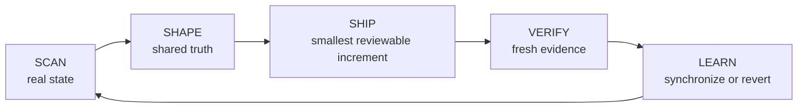

<div align="center">

<p><strong>AI SKILL · LOOP ENGINEERING · VERIFIED DELIVERY</strong></p>

# Swift Cycle

**From ambiguous requirements to verified AI delivery loops.**

A portable Agent Skill that turns evolving requirements into lightweight project structure, reviewable delivery increments, and evidence-backed outcomes—without importing heavyweight process.

<p>
  <a href="https://agentskills.io/specification"></a>
  <a href="https://github.com/Solismuchengxue/skill_swift_cycle/releases/latest"></a>
  <a href="LICENSE"></a>
  
</p>

[简体中文](README.zh-CN.md)

</div>

## Why Swift Cycle

AI-assisted delivery often breaks at the handoffs: requirements evolve, repository reality diverges from the plan, local execution notes become mistaken for shared truth, and “done” is declared without fresh evidence.

Swift Cycle reconnects those handoffs without turning a small project into a governance program. It inspects the real state, chooses process proportional to the task, ships the smallest reviewable increment, and synchronizes what was learned.

## Loop Engineering

**Loop Engineering is the discipline of keeping intent, execution, evidence, and learning connected in one short, repeatable feedback loop.**



The product model expands the loop; the execution rhythm stays intentionally short:

> Scan quickly → make the smallest useful change → verify immediately → continue or revert.

## AI Skill capabilities

| Capability | What Swift Cycle does |
| --- | --- |
| **Project shaping** | Reads the repository before acting, establishes only the useful project structure, and makes boundaries explicit. |
| **Adaptive execution** | Keeps simple work as a normal TODO; activates a milestone and dependency-ordered PR queue only when the work needs it. |
| **Evidence-backed delivery** | Keeps each increment reviewable, verifiable, and reversible, then continues or corrects based on fresh evidence. |
| **Portable orchestration** | Ships one standards-aligned Skill with localized guidance and host-specific metadata—without scripts, MCP servers, or external services. |

## Quick Start

GitHub CLI 2.90 or later can install the same Skill for multiple agent hosts.

### Codex

```powershell
gh skill install Solismuchengxue/skill_swift_cycle swift-cycle --agent codex --scope user
```

Invoke with `$swift-cycle`.

### Claude Code

```powershell
gh skill install Solismuchengxue/skill_swift_cycle swift-cycle --agent claude-code --scope user
```

Invoke with `/swift-cycle`.

### GitHub Copilot

```powershell
gh skill install Solismuchengxue/skill_swift_cycle swift-cycle --agent github-copilot --scope user
```

Invoke with `/swift-cycle`.

For project-only installation, replace `--scope user` with `--scope project`. See [agent compatibility](docs/compatibility.md) for platform behavior and manual installation paths.

## What this project demonstrates

Swift Cycle is also an engineering portfolio artifact: it shows how a compact AI capability can be shaped, packaged, bounded, and verified for real delivery work.

| FDE capability | Repository evidence |
| --- | --- |
| **Solution shaping** | Turns ambiguous maintenance requests into explicit scope, document responsibilities, and delivery contracts. |
| **AI Skill productization** | Packages a working methodology as a portable Agent Skill with bilingual guidance and host-specific metadata. |
| **Delivery orchestration** | Selects lightweight execution for small work and dependency-aware, PR-sized increments for larger work. |
| **Evidence-first execution** | Connects implementation, validation, rollback, and shared-state synchronization instead of treating output as proof. |
| **Cross-context communication** | Maintains equivalent English and Chinese product narratives for technical and business-facing readers. |

## How it works

### Shared truth and local execution

| Layer | Responsibility |
| --- | --- |
| `README.md` | User-facing value, installation, usage, and current limitations. |
| `DESIGN.md` + `docs/` | Durable design, requirements, roadmaps, evaluations, runbooks, and ADRs. |
| `AGENTS.md` | Repository-specific collaboration, safety, synchronization, and verification rules. |
| Local `TODO.md` | Current actions and blockers; only larger work adds an active milestone and PR queue. |
| Local `DEVLOG.md` | Failures, rejected approaches, maintenance evidence, and evolution history. |

The local TODO is an execution view, not the only long-term plan. Cross-machine commitments stay in a committable feasibility report, `docs/roadmap.md`, or a shared issue tracker.

### Proportional delivery

- **Simple task:** use a normal TODO checklist and the short verification loop.
- **Multi-PR or milestone task:** maintain a current milestone and dependency-ordered PR queue.
- **Every PR-sized increment:** record its ID, milestone, deliverable, scope, dependencies, verification, status, and PR link; keep it independently reviewable, verifiable, and reversible.

Small, local changes stay lightweight. Swift Cycle does not require an RFC, ADR, design document, or PR queue for every edit.

## Example delivery loops

```text
$swift-cycle Initialize a lightweight maintenance framework for this repository.
```

```text
$swift-cycle Review the current documentation boundaries and fix only meaningful drift.
```

```text
$swift-cycle Maintain this three-PR migration as a current milestone and dependency-ordered PR queue.
```

```text
$swift-cycle Close out this project, reconcile the docs, and extract reusable methodology.
```

Use the invocation syntax supported by your agent host.

## Compatibility and boundaries

- Swift Cycle is deliberately invoked by the user; it does not imply autonomous background execution.
- Codex, Claude Code, and GitHub Copilot use the same canonical package with host-specific behavior documented in [agent compatibility](docs/compatibility.md).
- English is the canonical instruction language. Simplified Chinese terminology lives in [`references/zh-CN.md`](skills/swift-cycle/references/zh-CN.md).
- The package follows the open [Agent Skills specification](https://agentskills.io/specification).
- No scripts, runtime dependencies, MCP servers, or external services are required.

## Repository layout

```text
skill_swift_cycle/
├─ skills/swift-cycle/
│  ├─ SKILL.md
│  ├─ agents/openai.yaml
│  └─ references/zh-CN.md
├─ docs/compatibility.md
├─ README.md
├─ README.zh-CN.md
├─ DESIGN.md
├─ AGENTS.md
└─ LICENSE
```

Words in the repository name are separated with `_`. The standards-defined Skill name remains `swift-cycle` because Agent Skills names permit lowercase letters, digits, and hyphens.

## License

Swift Cycle is released under the [MIT License](LICENSE).
