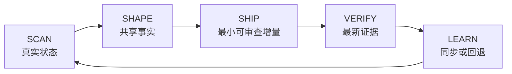

<div align="center">

<p><strong>AI SKILL · LOOP ENGINEERING · VERIFIED DELIVERY</strong></p>

# Swift Cycle（快速螺旋）

**把模糊需求转化为经过验证的 AI 交付循环。**

一个可移植的 Agent Skill：把持续变化的需求转化为轻量项目结构、可独立审查的交付增量和有证据支撑的结果，同时避免引入笨重流程。

<p>
  <a href="https://agentskills.io/specification"></a>
  <a href="https://github.com/Solismuchengxue/skill_swift_cycle/releases/latest"></a>
  <a href="LICENSE"></a>
  
</p>

[English](README.md)

</div>

## 为什么需要 Swift Cycle

AI 辅助交付最容易在衔接处失真：需求持续变化，仓库真实状态偏离计划，本地执行记录被误当成长期共享事实，而“完成”缺少最新验证证据。

Swift Cycle 把这些衔接重新接成一个短循环，同时不把小项目升级为治理工程。它先检查真实状态，再选择与任务规模相称的流程，交付最小可审查增量，并同步本轮学到的事实。

## Loop Engineering

**Loop Engineering 是让意图、执行、证据与学习始终连接在一个短小、可重复反馈循环中的工程纪律。**



产品模型展开了循环，但执行节奏仍刻意保持简短：

> 快速扫描 → 最小变更 → 立即验证 → 继续或回退。

## AI Skill 能力

| 能力 | Swift Cycle 的做法 |
| --- | --- |
| **项目塑形** | 行动前先读取仓库，只建立真正有用的项目结构，并明确边界。 |
| **自适应执行** | 简单任务保留普通 TODO；只有工作真正需要时，才启用里程碑与按依赖排序的 PR 队列。 |
| **证据驱动交付** | 让每个增量都可审查、可验证、可回退，再根据最新证据继续或修正。 |
| **可移植编排** | 以一份符合标准的 Skill 配合本地化指引和宿主元数据，不依赖脚本、MCP Server 或外部服务。 |

## 快速开始

GitHub CLI 2.90 或更高版本可以把同一份 Skill 安装给多个 Agent。

### Codex

```powershell
gh skill install Solismuchengxue/skill_swift_cycle swift-cycle --agent codex --scope user
```

使用 `$swift-cycle` 调用。

### Claude Code

```powershell
gh skill install Solismuchengxue/skill_swift_cycle swift-cycle --agent claude-code --scope user
```

使用 `/swift-cycle` 调用。

### GitHub Copilot

```powershell
gh skill install Solismuchengxue/skill_swift_cycle swift-cycle --agent github-copilot --scope user
```

使用 `/swift-cycle` 调用。

如果只希望当前项目使用，把 `--scope user` 改为 `--scope project`。不同平台的行为和手动安装路径见[兼容性说明](docs/compatibility.md)。

## 项目体现的工程能力

Swift Cycle 同时也是一个工程作品集项目：这个仓库展示了如何把紧凑的 AI 能力塑形、产品化、划定边界，并用真实验证支持交付。

| FDE 能力 | 仓库证据 |
| --- | --- |
| **方案塑形** | 把模糊的维护请求转化为明确范围、文档职责和交付合同。 |
| **AI Skill 产品化** | 把工作方法封装为可移植 Agent Skill，并维护双语指引与宿主专属元数据。 |
| **交付编排** | 小任务采用轻量执行，大任务拆成依赖明确、PR 大小的交付增量。 |
| **证据优先执行** | 连接实施、验证、回退与共享状态同步，不把输出本身当作完成证据。 |
| **跨语境沟通** | 为技术与业务读者维护语义一致的中英文产品叙事。 |

## 工作方式

### 共享事实与本地执行

| 层级 | 职责 |
| --- | --- |
| `README.md` | 面向用户的价值、安装、用法与当前限制。 |
| `DESIGN.md` + `docs/` | 可长期共享的设计、需求、路线图、评估、运行手册与 ADR。 |
| `AGENTS.md` | 仓库级协作、安全、同步与验证规则。 |
| 本地 `TODO.md` | 当前行动和阻塞项；只有较大工作才加入当前里程碑与 PR 队列。 |
| 本地 `DEVLOG.md` | 失败方案、内部判断、维护证据与演进历史。 |

本地 TODO 是当前执行视图，不是唯一长期计划。跨机器承诺继续放在可提交的可行性报告、`docs/roadmap.md` 或共享 Issue Tracker 中。

### 与任务规模相称的交付方式

- **简单任务：**使用普通 TODO 清单与短验证循环。
- **多 PR 或里程碑任务：**维护当前里程碑与按依赖排序的 PR 队列。
- **每个 PR 大小的增量：**记录 ID、里程碑、交付物、范围、依赖、验证、状态与 PR 链接，并确保它可独立审查、验证和回退。

简单、局部的修改继续保持轻量。Swift Cycle 不要求每次编辑都创建 RFC、ADR、设计文档或 PR 队列。

## 交付循环示例

```text
$swift-cycle 为当前仓库建立轻量级维护框架。
```

```text
$swift-cycle 检查当前文档职责是否漂移，只修正确实有价值的问题。
```

```text
$swift-cycle 把这个三 PR 迁移维护为当前里程碑和按依赖排序的 PR 队列。
```

```text
$swift-cycle 收敛项目文档，并从真实工作中提炼可复用方法论。
```

请根据所用 Agent 调整调用语法。

## 兼容性与边界

- Swift Cycle 由用户主动调用，不代表它会在后台自主运行。
- Codex、Claude Code 与 GitHub Copilot 使用同一份规范包；宿主差异见[兼容性说明](docs/compatibility.md)。
- 英文是规范指令语言，简体中文术语位于 [`references/zh-CN.md`](skills/swift-cycle/references/zh-CN.md)。
- 该包遵循开放的 [Agent Skills 规范](https://agentskills.io/specification)。
- 不需要脚本、运行时依赖、MCP Server 或外部服务。

## 仓库结构

```text
skill_swift_cycle/
├─ skills/swift-cycle/
│  ├─ SKILL.md
│  ├─ agents/openai.yaml
│  └─ references/zh-CN.md
├─ docs/compatibility.md
├─ README.md
├─ README.zh-CN.md
├─ DESIGN.md
├─ AGENTS.md
└─ LICENSE
```

仓库名中的多个单词使用 `_` 连接。Skill 名继续使用 `swift-cycle`，因为 Agent Skills 名称只允许小写字母、数字和连字符。

## 许可证

Swift Cycle 使用 [MIT License](LICENSE) 发布。
